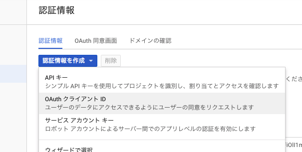
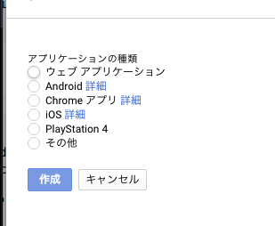

# ソーシャルログイン実装

* [react-redux](https://github.com/reactjs/react-redux) - Official React bindings for Redux 
* [react-router-dom](https://github.com/ReactTraining/react-router/tree/master/packages/react-router-dom) - DOM bindings for React Router
* [react-router-redux](https://github.com/reactjs/react-router-redux) - Ruthlessly simple bindings to keep react-router and redux in sync
* [redux](https://github.com/reactjs/redux) - Predictable state container for JavaScript apps 
* [redux-thunk](https://github.com/gaearon/redux-thunk) - Thunk middleware for redux

### Use
```sh
$ npm install
$ npm start
```

## npmをインストール
- https://github.com/keppelen/react-facebook-login
- `npm install react-facebook-login`をインストール
- `npm install react-google-login`をインストール

## facebooke developersでセットアップ
- `https://developers.facebook.com/`
- 新しいアプリを作成を押して「表示名」「連絡先メールアドレス」等を入力（2018年４月時点　バージョンによって変更あり）
- 設定ができたらダッシュボードで管理画面に入りアプリIDをコピーしておく
- App.jsを修正
```js
      <Router history={ this.props.history }>
        <div>
        //exactをLoginコンポーネントに
          <Route exact path="/" component={ Login }/>
        //Homeコンポーネントへ遷移設定
          <Route path="/home" component={ Home } />
        </div>
      </Router>
    );
```
- views/Login.jsを作成
- App.jsに`import Login from './views/Login'`をインポートしておく
- Login.jsの雛形を作成
```js
import React, { Component } from 'react'
import './index.css';

class Login extends Component {
  render(){
    return(
      <div className="Login">
        <div className="Login-box">
          <button id="facebook">Facebook</button>
          <button id="google">Google</button>
        </div>
      </div>
    );
  }
}

export default Login;
```
- views/index.cssを作成してボタンにスタイリング

## materialize-cssを使ってレイアウトを整える
- `npm install materialize-css`インストールする
- `http://materializecss.com/`
- Login.jsにインポート
```js
import 'materialize-css/dist/css/materialize.min.css';
```
- http://materializecss.com/buttons.html
- スタリングしたいパーツを検索して適用させていく
- `http://materializecss.com/color.html`色はここから
- 使い方
```js
//好きな色を調べてblue accent-3こんな感じでクラスに指定するだけ
<button className="waves-effect waves-light btn blue accent-3" id="facebook">Facebook</button>

```

####  materialize.cssのアイコンを使う場合
- `http://materializecss.com/icons.html`に行き
- `  <link href="https://fonts.googleapis.com/icon?family=Material+Icons" rel="stylesheet">
`これをpublic/index.htmlに貼り付ける

###＃ fontawesomeのアイコンを使う場合
- `https://fontawesome.com/get-started`
- `<link rel="stylesheet" href="https://use.fontawesome.com/releases/v5.0.10/css/all.css" integrity="sha384-+d0P83n9kaQMCwj8F4RJB66tzIwOKmrdb46+porD/OvrJ+37WqIM7UoBtwHO6Nlg" crossorigin="anonymous">

`これをpublic/index.htmlに読み込み（2018年４月時点でバージョン変わってる）


### facebookLoginの実装
- Loginコンポーネントにインポート`import FacebookLogin from 'react-facebook-login'`
```js
import React, { Component } from 'react'
import './index.css';
import 'materialize-css/dist/css/materialize.min.css';
import FacebookLogin from 'react-facebook-login'


class Login extends Component {
  constructor() {
    super();
    this.responseFacebook = this.responseFacebook.bind(this);
    this.onFailure = this.onFailure.bind(this);
  }

  responseFacebook(response){

  }
  onFailure(error){

  }
  render() {
    return (
      <div className="Login">
        <div className="Login-box">
          <div className="card">
            <div className="card-content">
            //ドキュメントに書かれてるものを使って設定する
            <FacebookLogin 
                appId="xxxここはダッシュボードのID"
              autoload= {false}
              fields="name, email, picture.width(120)"
              callback={ this.responseFacebook}
              onFailure={this.onFailure}
              textButton="Facebook"
                cssClass="waves-effect waves-light btn blue accent-3"
                icon="fab fa-facebook-f"
            />
       
       
              <button className="waves-effect waves-light btn red lighten-1" id="google">Google<i className="fab fa-google"></i>
              </button>
            </div>
          </div>
        </div>
      </div>
    );
  }
}

export default Login;
```

#### ダッシュボード/設定/でfacebookログインの設定
- Facebookログイン/設定/リダイレクトの設定をする
- 有効なOAuthリダイレクトURIにローカルホストのポートを入力
- `https://localhost:3000/`(※3000番で起動しているとき) 2018/4月時点でhttpsでやれと怒られるので注意
- `https://github.com/facebook/create-react-app/issues/1411`ここに記載
- pakage.jsonを修正
```js
  "scripts": {
    //これで動くhttps化
    "start": "HTTPS=true react-scripts start",
    "build": "react-scripts build",
    "test": "react-scripts test --env=jsdom",
    "eject": "react-scripts eject"
  }
  //これめちゃくちゃはまったので注意
```
- https://ngrok.comもしくはこれ使う
- https://qiita.com/kitaro729/items/44214f9f81d3ebda58bdこの辺とか見るとよき

## localstrageに保存
```js
//localStorageにセットアイテムで保存
  localStorage.setItem("fbData", JSON.stringify({
    token: response.token,
    email: response.email,
    name: response.name,
    picture: response.picture.data.url,
    social: 'fb'
  }));
```

### Redirect
- `import { Redirect } from 'react-router-dom'`を読み込んで使う
```js
class Login extends Component {
  constructor() {
    super();

  //ここでstateを定義
  this.state = {
    isLogged: false,
    social: ''
  }

  this.responseFacebook = this.responseFacebook.bind(this);
  this.onFailure = this.onFailure.bind(this);
}

//responseが帰ってきたらローカルストレージにツッコミ
responseFacebook(response) {
  console.log(response)
  localStorage.setItem("fbData", JSON.stringify({
    token: response.token,
    email: response.email,
    name: response.name,
    picture: response.picture.data.url,
    social: 'fb'
  }));
  //setStateでstateを更新
  this.setState({
    isLogged: true
  });
}

onFailure(error) {
  console.log(error)
}

render() {
  //stateが更新されたら条件付きレンダリングでログインしている際にHomeに飛ばす
  if(this.state.isLogged){
    return(<Redirect to="/home/" />);
  }
```

## Googleログイン
- https://console.developers.google.com/projectselector/apis/dashboard
- 認証情報/認証情報を作成/クライアントIDの作成/必要な情報を入力
- クライアントIDがいる、それでリダイレクトのところとか諸々設定(localhost:3000番で起動ならそれ)
- 
- 
- views/Login.jsに`import GoogleLogin from 'react-google-login'`をインポート
- `https://github.com/anthonyjgrove/react-google-login`で雛形をコピー
```js
  clientId=""
  autoload={ falase }
  onSuccess={ this.responseGoogle }
  onFailure={this.onFailure}
```
```js

<GoogleLogin 
  clientId="apps.googleusercontent.com"
  autoload={ false }
  onSuccess={ this.responseGoogle }
  onFailure={this.onFailure}
  className="waves-effect waves-light btn red lighten-1">
  <i className="fab fa-google"></i>
  <span>Inciar Sesion</span>
</GoogleLogin>

```